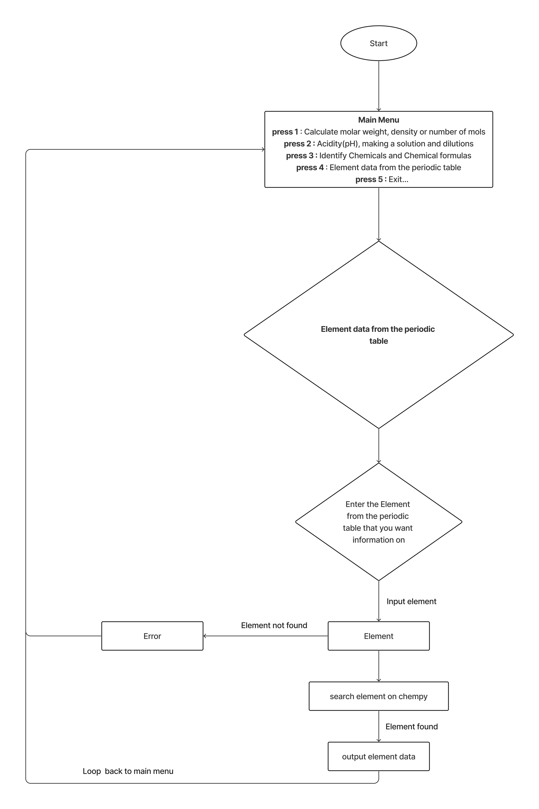

# AnushkeKarunaratna_T1A3

## **Project Description**

Creating a chemistry calculator for students or anyone interested in chemistry. This application will help determine characteristics  of a compound  and also identify compounds

Features include
- A calculator to determine molar weight, density and mols of the compound
- A PH calculator to calculate acidity of a solution and also calculate dilutions and molarity of a solution
- An 'identifier' to identify compounds and chemical formulas
- Data on elements from the periodic table

## **Installation**

Installing dependencies

```pip install -r ./src/requirements.txt```

Running Bash script

```bash ./src/run_main.sh```

## **Design**

### **General flowchart of app**


### **Calculate molar weight, density or number of mols**


### **Acidity(pH), making a solution and dilutions**

### **Identify Chemicals and Chemical formulas**

### **Element data from the periodic table**

## **Functionality & Features**

### **Main Menu**
As soon as the program is running a menu of options is available to choose from. Type in the number to acess the submenu's


```
-------Main Menu-------
press 1 : Calculate molar weight, density or number of mols
press 2 : Acidity(pH), making a solution and dilutions
press 3 : Identify Chemicals and Chemical formulas
press 4 : Element data from the periodic table

--Other Options--
press 5 : Exit

Enter an option: 
```
### **Press 1 - Calculate molar weight, density or number of mols**
Pressing one from the main menu gives access to the submenu for calculating molar weight, density or number of mols. Type in the number to access the relevant option 

```
-------Calculate molar weight, density or number of mols-------
press 1 : Calculate molar weight
press 2 : Calculate density
press 3 : Calculate number of mols
press 4 : Exit

Enter an option: 
```
### **Press 1 -> Press 1 - Calculate molar weight**
Please see the below example 

```
To calculate the molar weight of a compound we need to know the element and how many of each element is in the compound

-> How many elements in the compound: 2

-> What is the first element (enter symbol): C
-> How many elements?: 2

-> What is the second element (enter symbol): O
-> How many elements?: 4

--> The molecular weight of this compound is 88.018 g/mol
```

### **Press 1 -> Press 2 - Calculate density**
Please see the below example 
```
To calculate the density of a compound we need to the mass(g) and volume(cm3) of the compound

-> What is the mass (g)?: 35
-> What is the volume (cm3)?: 67

--> The density of the compound is 0.52 g/cm3
```
### **Press 1 -> Press 3 - Calculate number of mols**
Please see the below example 
```
To calculate the number of mols of a compound we need to the mass(g) and molecular weight (g/mol) of the compound

-> What is the mass (g)?: 45
-> What is the molecular mass (g/mol)?: 87

--> The number of mols, when mass is 45.0 (g) and molecular weight is 87.0 (g/mol) is, 0.52 (mol)
```

### **Press 2 - Acidity(pH), making a solution and dilutions**
Pressing two from the main menu gives access to the submenu for calculating acidity, dilution and solution calculations. Type in the number to access the relevant option 
```
-------Acidity(pH), making a solution and dilutions-------
press 1 : Calculate acidity
press 2 : Making a solution
press 3 : Calculate dilutions
press 4 : Exit

Enter an option:  
```
### **Press 2 -> Press 1 - Calculate acidity**
Please see the below example 
```
To calculate the pH please insert the concentration (moles per litre)
-> What is the concentration (moles per litre)?: 8900

--> The pH is 3.9494

--> This is a base solution
```
### **Press 2 -> Press 2 - Making a solution**
Please see the below example
```
-> What is the formula of the solute?: H20
-> How many grams of solute?: 45
-> How many liters of solution?: 89
0.0251
```
### **Press 2 -> Press 3 - Calculate dilutions**
Please see the below example
```
-> What is the formula of the solution?: H20
-> What is the volume of the solution?: 56
-> What is the molarity of the solution: 89
-> What is the molarity after dilution?: 34
{'Solute': 'H₂₀', 'Molarity': 34.0, 'Volume': 146.58823529411765}
```

### **Press 3 - Identify Chemicals and Chemical formulas**
Pressing three from the main menu gives access to the submenu for identifying chemicals and chemical formulas. Type in the number to access the relevant option 
```
-------Identify Chemicals and Chemical formulas-------
press 1 : Identify chemical formula
press 2 : Identify chemical
press 3 : Exit

Enter an option: 
```
### **Press 3 -> Press 1 - Identify chemical formulas**
Please see the below example
```
-> Enter the chemical name to identify its chemical formula: Ammonium sulfate
--> The chemical formula of Ammonium sulfate is (NH4)2SO4
```
### **Press 3 -> Press 2 - Identify chemical**
Please see the below example
```
-> Enter chemical formula to identify the chemical: Al2(SO4)3
--> The chemical with a Al2(SO4)3 is Aluminium sulfate
```
### **Press 4 - Element data from the periodic table**
Please see the below example
```
-> Enter the Element from the periodic table that you want information on: Uranium
--> Printing information on Uranium from the periodic table

Atomic No.      Name            Symbol          Mass
92              Uranium         U               238.02891
--> Data for element is printed according
```

## **Testing**
Testing data and rules followed can be found in the docs folder

## **Contact Links**

Anushke - anushke.k@gmail.com 

Project link - https://github.com/nush16/AnushkeKarunaratna_T1A3

Vimeo - 

Trello - https://trello.com/b/k3Xc4LIL/t1a3
    
## **Acknowledgements**
https://byjus.com/chemical-compound-formulas/ - data for chemicals and chemical formulas

